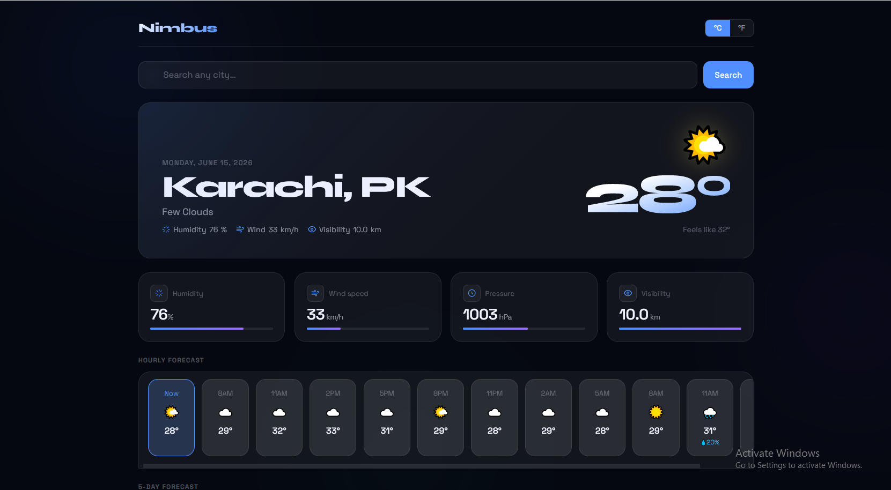

# 🌤️ Nimbus — Weather App

Nimbus is a modern and responsive **Weather Application** designed to provide real-time weather information with a clean, intuitive, and visually appealing user interface.

The application allows users to search for any city worldwide and instantly access current weather conditions, temperature, humidity, wind speed, and other essential weather details.

Built using **HTML, CSS, and JavaScript**, Nimbus demonstrates modern front-end development practices, API integration, responsive design, and interactive user experiences.

---

## 🌐 Live Demo

🔗 **View Live Website**
https://devbyfahad.github.io/Nimbus---Weather-App/

---

## 📸 Screenshots

### Weather Dashboard



### City Weather Search


---

## ✨ Features

🌍 **Search Weather by City**
Get real-time weather information for cities around the world.

🌡️ **Live Temperature Updates**
Displays current temperature and weather conditions instantly.

💧 **Humidity Information**
View current humidity levels for any searched location.

🌬️ **Wind Speed Tracking**
Access accurate wind speed data in real time.

📱 **Fully Responsive Design**
Optimized for desktop, tablet, and mobile devices.

⚡ **Fast & Lightweight**
Quick weather searches with a smooth user experience.

🎨 **Modern User Interface**
Clean design with intuitive navigation and weather visuals.

🔗 **Weather API Integration**
Fetches live weather data from a weather service API.

---

## 🛠️ Technologies Used

* **HTML5**
* **CSS3**
* **JavaScript (ES6)**
* **Weather API**
* **Responsive Design**

---

## 📂 Project Structure

```text
Nimbus---Weather-App
│
├── index.html
├── style.css
├── script.js
│
├── images
│   ├── weather-dashboard.png
│   ├── weather-search.png
│
└── README.md
```

---

## 🚀 Installation & Setup

If you want to run this project locally:

```bash
# Clone the repository
git clone https://github.com/DevByFahad/Nimbus---Weather-App.git

# Open the project folder
cd Nimbus---Weather-App

# Run the application
Open index.html in your browser
```

---

## 🎯 Project Purpose

This project was created to:

* Practice API integration using JavaScript
* Build a real-world weather application
* Improve front-end development skills
* Learn responsive web design principles
* Create a portfolio-ready project

---

## 👨‍💻 Author

**Muhammad Fahad**

Frontend Developer passionate about building modern, responsive, and user-friendly web applications.

🔗 GitHub:
https://github.com/DevByFahad

---

## ⭐ Show Your Support

If you found this project useful, consider giving it a **⭐ star** on GitHub.

---

## 📄 License

This project is open source and available under the **MIT License**.
